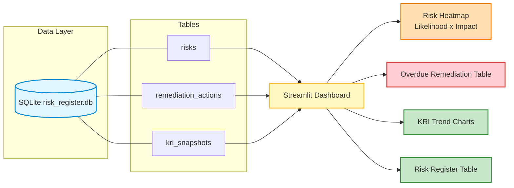

# 📊 GRC Risk & Compliance Dashboard

[](https://www.python.org/)
[](https://streamlit.io/)
[](https://www.sqlite.org/)
[](LICENSE)

An interactive risk register and KRI/KPI dashboard, built to mirror the executive risk
and compliance reporting produced in enterprise GRC platforms (ServiceNow GRC / RSA
Archer) — but as a lightweight, reproducible SQL + Streamlit app instead of a licensed
platform.

## Why this exists

A big part of a GRC engineer's job is turning a spreadsheet of risks and remediation
actions into something leadership can actually act on: which risks are above appetite,
which remediation items are overdue, and whether compliance metrics are trending in the
right direction. This project builds that reporting layer end-to-end — schema, synthetic
data, risk math, and the dashboard itself.

## Architecture



## Data model

`risks` — inherent risk (likelihood × impact), control effectiveness, and residual risk
(`inherent_risk × (1 − control_effectiveness)`), each mapped to a framework reference
(NIST CSF 2.0, PCI-DSS v4.0, SOX ITGC, ISO 27001).

`remediation_actions` — CAP-style corrective action items with owner, due date, and
status, so overdue-rate can be computed directly.

`kri_snapshots` — monthly time series for key risk indicators (overdue remediation
rate, control test pass rate, third-party assessment completion, etc.) against a
defined threshold.

See [`db/schema.sql`](db/schema.sql) for the full schema.

## Quick start

```bash
pip install -r requirements.txt
python db/seed_data.py          # generates synthetic sample data into db/risk_register.db
streamlit run app/dashboard.py
```

Open the local URL Streamlit prints (defaults to `http://localhost:8501`).

## 🤖 CI/CD & Testing

This project includes a Python test suite and automated CI/CD checks:
- **Unit Tests**: Built with `pytest` to test the SQLite database seeding process (`tests/test_seed_data.py`) and the risk calculation math (`tests/test_calculations.py`).
- **CI/CD Pipeline**: A GitHub Actions workflow (`.github/workflows/python-ci.yml`) runs on push/pull request. It checks formatting (`flake8`), performs security analysis (`bandit`), seeds the database, and runs the test suite.

To run tests locally:
```bash
pip install pytest
pytest
```

## What the dashboard shows

- **KPI cards** — open risks, high residual-risk count, overdue remediation %, average residual risk
- **Risk heatmap** — likelihood × impact density across the open risk population
- **Risk distribution by category** — Technology, Third-Party, Operational, Compliance, Financial
- **KRI trend lines** — 7-month history per metric against its threshold
- **Overdue remediation table** — every past-due CAP item with owner and risk linkage
- **Full risk register** — sortable, filterable table of every risk with computed residual score

## Project structure

```
grc-risk-dashboard/
├── .github/workflows/
│   └── python-ci.yml       # GitHub Actions CI workflow
├── db/
│   ├── schema.sql          # risk register schema
│   └── seed_data.py        # synthetic sample data generator
├── app/
│   └── dashboard.py        # Streamlit dashboard
├── tests/
│   ├── test_calculations.py# tests risk calculations
│   └── test_seed_data.py   # tests SQLite database seeding
└── requirements.txt
```

## Notes

All data is synthetically generated (`db/seed_data.py`, seeded for reproducibility) and
does not represent any real organization's actual risk posture.

## Roadmap

- [ ] Power BI export path alongside the Streamlit view
- [ ] Configurable risk appetite thresholds per business unit
- [ ] Historical trend view per individual risk (not just aggregate KRIs)

## About

Built by [Mihir Ajmera](https://linkedin.com/in/mihirajmera) — GRC Engineer specializing
in enterprise risk management, compliance dashboards, and KRI/KPI reporting with SQL and
Power BI.
